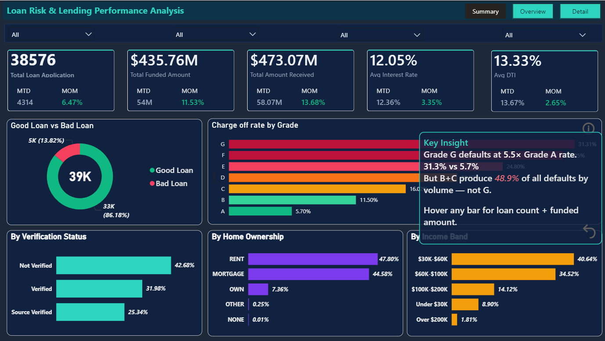
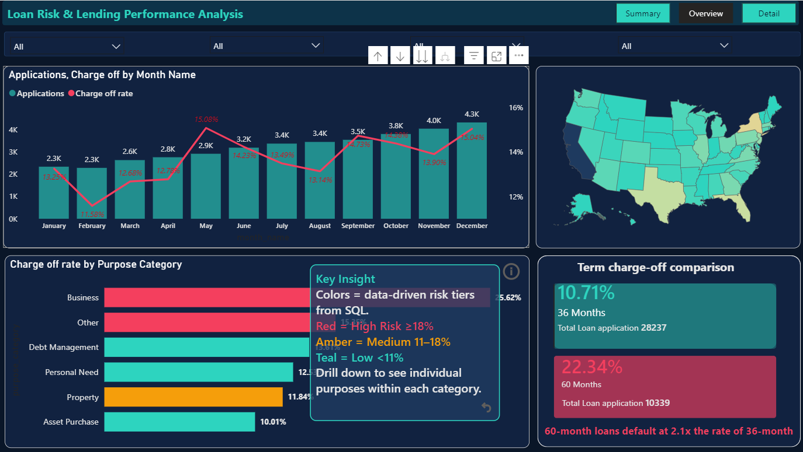
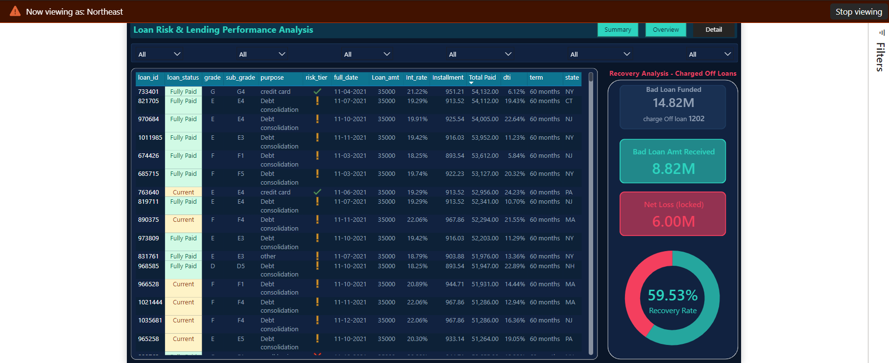

# 📊 Loan Risk & Lending Performance Analysis

**Tools:** SQL (MySQL) · Power BI · Data Modeling  

---

## 🔹 Business Problem

Banks need to monitor loan performance and identify high-risk borrowers to reduce defaults and improve profitability. This project analyzes lending data to uncover patterns in borrower risk, loan performance, and repayment behavior — enabling better credit decision-making.

---

## 🔹 Dataset

- 38,576 loan records (Full year 2021)  
- $435.8M total funded · $473.0M total received  
- 13.8% charge-off rate — 5,333 defaulted loans  
- $28.2M permanent net loss  
- $65.5M lent to defaulters · $37.3M recovered (56.9% recovery rate)  

---

## 🔹 Key Insights

- **Grades B & C are the primary loss drivers**, accounting for ~49% of total defaults — volume outweighs extreme risk segments  
- **60-month loans default at 2.1× the rate of 36-month loans**, with 1.6× larger loan sizes, amplifying financial loss  
- **All 1,098 currently active loans are 60-month**, indicating additional future risk not yet realized  
- **Business-purpose loans carry structural risk across all grades**, including 11.4% default rate even for Grade A borrowers  
- **Largest risk concentration:** Grade E + Debt Management ($31.8M at 24.8% default rate)  
- **Verified borrowers default more than unverified ones** (15.7% vs 12.2%) due to higher loan exposure  

---

## 🔹 Business Impact

- Reframed portfolio risk focus — mid-risk borrowers represent the largest loss exposure  
- Identified term-based risk, supporting tighter controls on long-term loans  
- Quantified $28.2M in permanent losses beyond simple default counts  
- Enabled risk segmentation strategies (grade × purpose × term) for better decision-making  

---

## 📊 Dashboard Preview

---

## 🔹 Dashboard Overview

**Page 1 — Summary:**  
- KPI strip with MTD/MoM metrics  
- Loan status breakdown  
- Grade distribution, verification analysis, income segmentation  

**Page 2 — Risk View:**  
- Dual-axis trend (volume vs charge-off rate)  
- Purpose-based risk tiers (SQL-driven)  
- Term comparison (36 vs 60 months)  
- Geographic distribution  

**Page 3 — Detail:**  
- Loan-level dataset (14 columns)  
- Risk tier assigned per loan  
- Recovery panel (portfolio-level)  
- Multiple interactive filters  

**Page 4 — Insights:**  
- 8 insight cards  
- 5 actionable recommendations  
- Fully traceable to dashboard visuals  

---

## 🔹 Data Modeling (SQL)

- Transformed flat dataset into a **star schema (1 fact + 4 dimensions)**  

**Fact Table:**
- `fact_loan` — loan-level metrics  

**Dimension Tables:**
- `dim_grade` — credit hierarchy with risk labels  
- `dim_purpose` — risk tiers derived via SQL (CTE-based classification)  
- `dim_date` — full 365-day calendar using stored procedure  
- `dim_region` — geographic segmentation  

- Evaluated and rejected `dim_borrower` due to lack of dimensional value  

---

## 🔹 Technical Highlights

- **SQL:** CTE-based dynamic risk classification (no hardcoding)  
- **SQL Debugging:** Resolved misalignment between fact and dimension tables  
- **DAX:** Accurate time intelligence using CALCULATE + DATESMTD  
- **Dynamic Visualization:** Chart colors driven by SQL-derived risk tiers  
- **Recovery Analysis:** Fixed filter context to maintain portfolio-level consistency  
- **Validation:** All KPIs cross-checked with SQL outputs  

---

## 🔹 Notable Analytical Decisions

- Introduced **recovery panel** to highlight real financial loss instead of just default count  
- Treated **current loans separately** instead of grouping them with fully paid loans  
- Focused on **financial impact over percentages**  

---

## 🔹 What This Project Demonstrates

- End-to-end ownership: data → modeling → analysis → dashboard → insights  
- Strong SQL and data modeling capabilities  
- Advanced Power BI and DAX usage  
- Analytical reasoning and decision-making  
- Business-focused communication  

---

## 📄 Additional Documentation

- SQL Modeling & Validation: [View PDF](SQL-data-modeling & Validation....pdf)  
- Database Schema: [View PDF](database-schema.pdf)  
- Insights Analysis: [View PDF](key-insights.pdf)  

